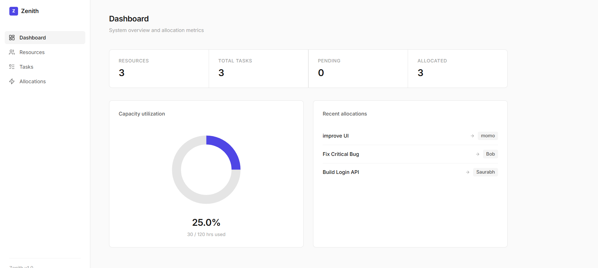
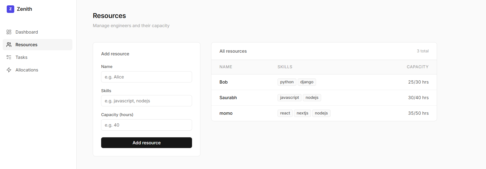
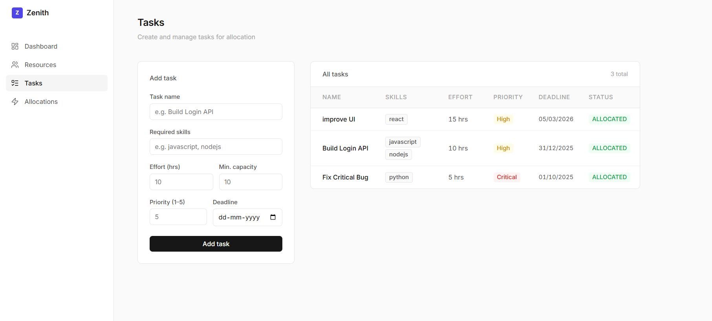
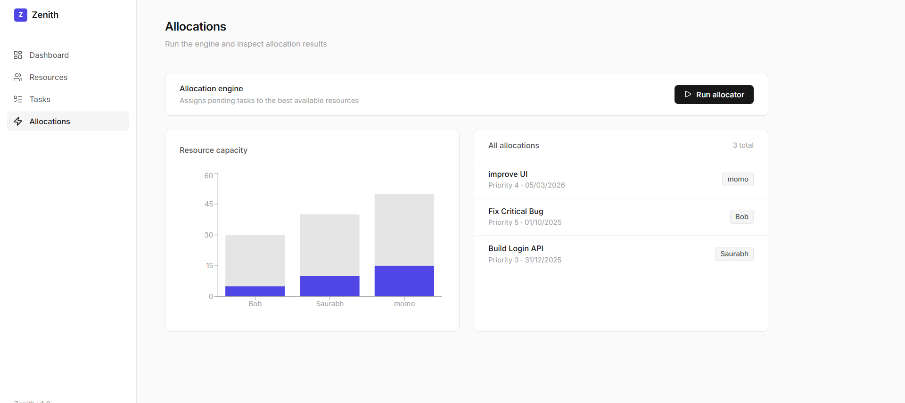

# Zenith

A resource allocation system that intelligently assigns tasks to team members based on skills, capacity, priority, and deadlines.

## Screenshots









## Overview

Zenith solves the problem of manually assigning work to engineers. Given a set of resources (people with skills and available hours) and tasks (work items with requirements), the allocation engine matches tasks to the best-fit resource automatically.

**How allocation works:**

1. Tasks are sorted by priority (highest first), then by deadline (earliest first)
2. For each task, the engine filters resources that have the required skills and enough available capacity
3. Among candidates, the resource with the most available capacity is selected
4. The resource's available capacity is decremented by the task's estimated effort

## Tech Stack

| Layer    | Technology                        |
| -------- | --------------------------------- |
| Frontend | Next.js 16, React 19, Recharts    |
| Backend  | Express 5, Node.js                |
| Database | MySQL (via mysql2)                |
| Icons    | Lucide React                      |

## Project Structure

```
Zenith-Project/
├── backend/
│   └── src/
│       ├── server.js                  # Express server entry point
│       ├── config/
│       │   └── db.js                  # MySQL connection pool
│       ├── controllers/
│       │   ├── resourceController.js  # Create & list resources
│       │   ├── taskController.js      # Create & list tasks
│       │   └── allocationController.js# Run allocation & list results
│       ├── routes/
│       │   ├── resourceRoutes.js
│       │   ├── taskRoutes.js
│       │   └── allocationRoutes.js
│       └── services/
│           └── allocationService.js   # Core allocation algorithm
├── frontend/
│   └── src/
│       └── app/
│           ├── layout.js              # Root layout with sidebar
│           ├── page.js                # Dashboard
│           ├── globals.css            # Design tokens & base styles
│           ├── components/
│           │   └── Sidebar.js         # Navigation sidebar
│           ├── resources/
│           │   └── page.js            # Resource management
│           ├── tasks/
│           │   └── page.js            # Task management
│           └── allocations/
│               └── page.js            # Allocation engine & results
└── README.md
```

## Prerequisites

- **Node.js** v18+
- **MySQL** 8.0+

## Setup

### 1. Database

Create a MySQL database and the required tables:

```sql
CREATE DATABASE zenith;
USE zenith;

CREATE TABLE resources (
  id VARCHAR(36) PRIMARY KEY,
  name VARCHAR(255) NOT NULL,
  skills JSON,
  total_capacity INT NOT NULL,
  available_capacity INT NOT NULL
);

CREATE TABLE tasks (
  id VARCHAR(36) PRIMARY KEY,
  name VARCHAR(255) NOT NULL,
  required_skills JSON,
  estimated_effort INT NOT NULL,
  minimum_capacity_needed INT NOT NULL,
  priority INT NOT NULL,
  deadline DATE,
  status VARCHAR(20) DEFAULT 'PENDING'
);

CREATE TABLE allocations (
  id INT AUTO_INCREMENT PRIMARY KEY,
  task_id VARCHAR(36),
  task_name VARCHAR(255),
  resource_id VARCHAR(36),
  resource_name VARCHAR(255),
  priority INT,
  deadline DATE
);
```

### 2. Backend

```bash
cd backend
npm install
```

Create a `.env` file in the `backend/` directory:

```
DB_HOST=localhost
DB_USER=root
DB_PASSWORD=your_password
DB_NAME=zenith
PORT=5000
```

Start the server:

```bash
npm run dev
```

The API runs on `http://localhost:5000`.

### 3. Frontend

```bash
cd frontend
npm install
npm run dev
```

The app runs on `http://localhost:3000`.

## API Endpoints

| Method | Endpoint       | Description                        |
| ------ | -------------- | ---------------------------------- |
| GET    | `/resources`   | List all resources                 |
| POST   | `/resources`   | Create a resource                  |
| GET    | `/allocations` | List all allocations               |
| POST   | `/allocate`    | Run the allocation engine          |
| GET    | `/tasks`       | List all tasks                     |
| POST   | `/tasks`       | Create a task                      |

### Create a resource

```json
POST /resources
{
  "name": "Saurabh",
  "skills": ["javascript", "nodejs"],
  "total_capacity": 40
}
```

### Create a task

```json
POST /tasks
{
  "name": "Build Login API",
  "required_skills": ["javascript", "nodejs"],
  "estimated_effort": 10,
  "minimum_capacity_needed": 10,
  "priority": 5,
  "deadline": "2026-03-15"
}
```

### Run allocation

```json
POST /allocate
// No body required. Returns allocations, unallocated tasks, and utilization metrics.
```

## Pages

- **Dashboard** — Summary stats (resource count, task count, pending/allocated), capacity utilization chart, recent allocations
- **Resources** — Add engineers with skills and hourly capacity; view all resources in a table
- **Tasks** — Create tasks with skill requirements, effort estimates, priority, and deadlines; view all tasks
- **Allocations** — Trigger the allocation engine, view capacity charts, and inspect assignment results

